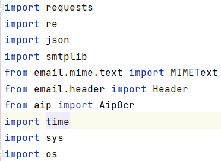
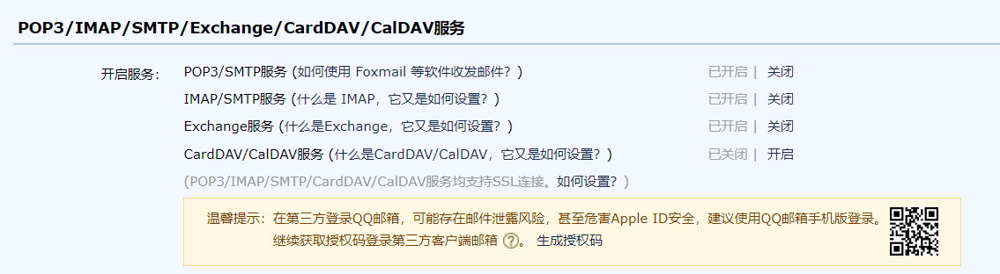
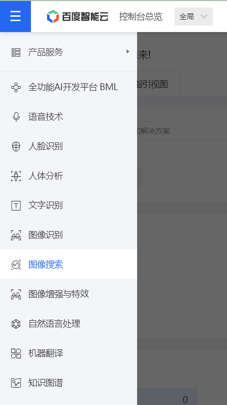
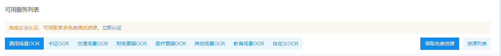
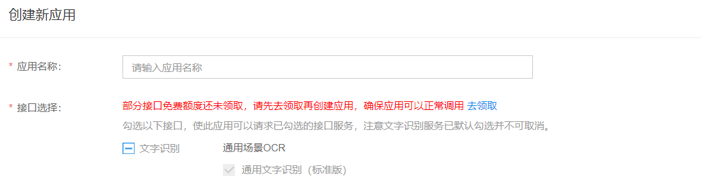
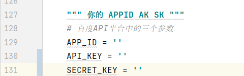

# SCU DairyNote

**作者邮箱：icexyz787@gmail.com**

[TOC]

本程序主要使用Python的[Request](https://docs.python-requests.org/zh_CN/latest/)库来发送Http请求，以达到模拟打卡的目的。:smile:

## 本程序可以具有以下功能

1. 通过调用百度OCR API接口，可以实现验证码的识别

2. 通过保存Cookies来避免过多的调用百度OCR API接口（接口次数有限制）

## 程序结构

>main.py 主程序
captcha(文件夹)：存放保存的验证码
namepassword.txt 存放你的学号和密码，二者以空格隔开
cookies.txt 保存cookies

## 程序使用方法

### 包的安装

程序中使用到的包如下图所示：

1. Request

    > pip install request

2. smtplib

    > pip install smtplib

3. 其他的包不一一列举

### 程序的配置

本程序的主要需要配置两个方面的参数：**email参数**与**百度OCR API参数**

### email参数（以qq邮箱为例）

1. 如下图所示，在 *设置*->*账户* 中打开**SMTP服务**，然后点击生成授权码

    

2. 在`main.py`的**mail_pass**（Line 75）中填入生成的授权码（不需要空格！）

### 百度OCR API参数

1. 前往[百度OCR网站](https://ai.baidu.com/tech/ocr)注册

2. 前往**控制台**，打开**文字识别**，如下图所示

     

3. 领取免费资源

   

4. 创建应用

    

5. 将应用的相关参数填入程序（**AppID，API Key，Secret Key**）

   

